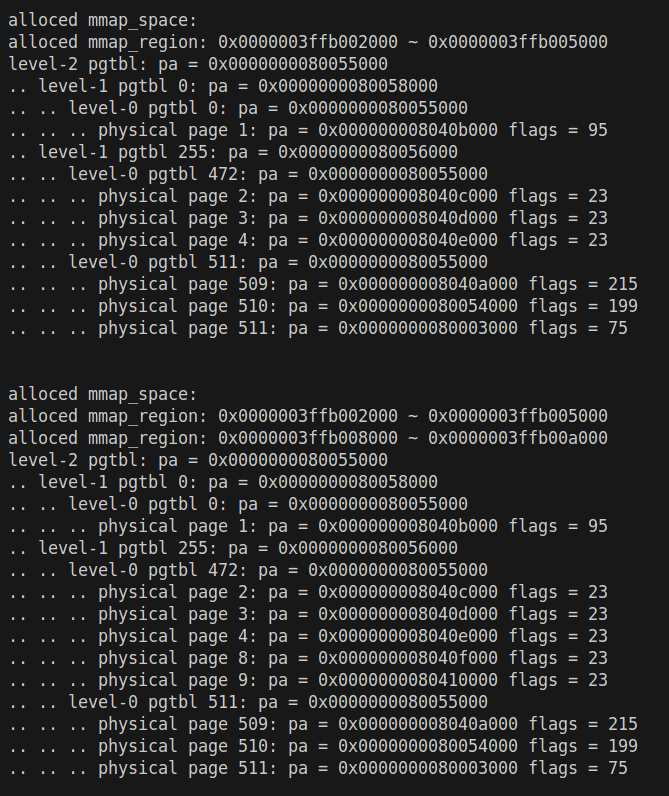
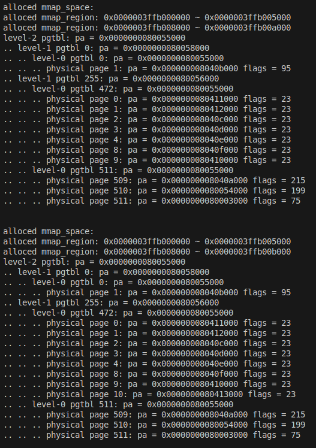
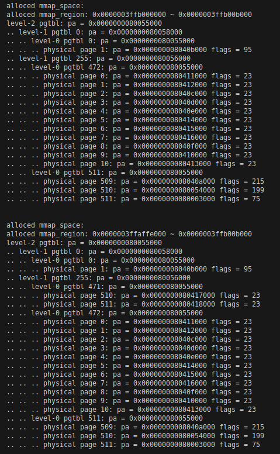
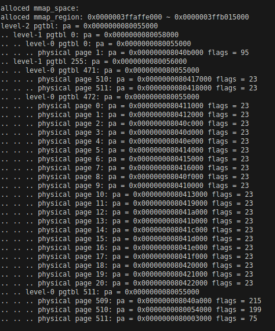
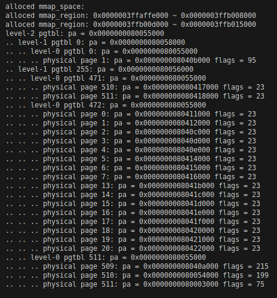
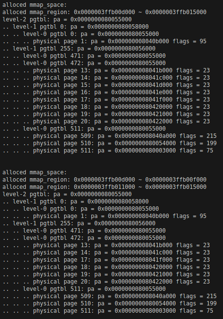
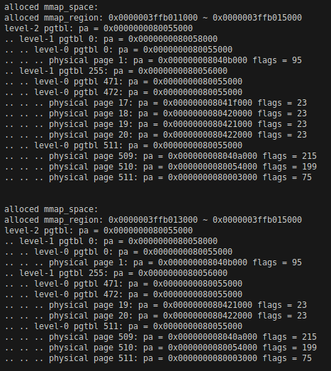
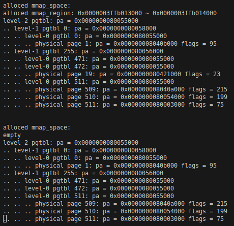

# LAB-5: 系统调用流程建立 + 用户态虚拟内存管理

**前言**

在lab-4中, 我们初步实现了第一个用户进程`proczero`

它通过`hello`系统调用, 利用内核的系统服务发出了"第一声啼哭"

本次实验的核心目的是完善和发展`proczero`, 具体包括两个方面:

- 赋予`proczero`更强的内存掌控能力, 包括堆、栈、离散映射三个部分

- 赋予`proczero`完善的请求服务能力, 建立真正的系统调用流程

## 代码组织结构

```
ECNU-OSLAB-2026-RS
├── pictures       README使用的图片目录 (CHANGE, 日常更新)
├── README.md      实验指导书 (CHANGE, 日常更新)
├── crates
│   ├── uapi/src/lib.rs (CHANGE, 系统调用号)
│   └── kernel/src
│       ├── mem
│       │   ├── uvm.rs (TODO, 用户态虚拟内存管理主体)
│       │   └── mmap.rs (TODO, mmap节点资源仓库)
│       ├── trap/user.rs (TODO, 系统调用处理 + pagefault处理)
│       ├── proc/mod.rs (TODO, PROCZERO.mmap初始化)
│       ├── syscall
│       │   ├── mod.rs (NEW, 系统调用通用逻辑)
│       │   ├── sysfunc.rs (TODO, hello处理逻辑)
│       │   └── memory.rs (TODO, 内存系统调用处理逻辑)
│       └── main.rs (TODO, 初始化节点仓库)
└── user/src
    ├── bin/init.rs (按测试需求修改)
    ├── syscall.rs (CHANGE)
    └── arch/riscv64.rs
```

**标记说明**

**NEW**: 新增源文件, 直接拷贝即可, 无需修改

**CHANGE**: 旧的源文件发生了更新, 直接拷贝即可, 无需修改

**TODO**: 你需要实现新功能 / 你需要完善旧功能

## 任务1：用户态和内核态的数据迁移

回忆一下上个实验的`hello`系统调用, 它的作用是让内核输出`"hello world"`

一个明显的问题: 这个系统调用没有接收用户参数, 导致系统服务非常僵硬和受限

我们可以从普通函数的参数传递获得启示, 传参方法无非两种:

- 直接传递值: `add(a: i32, b: i32)`, 本质是将参数值放到寄存器里

- 基于地址做间接传递: `compare(a: &[u8], b: &[u8])`, 切片包含地址和长度, 系统调用需要分别传递它们

通过阅读`user/src/arch/riscv64.rs`, 可以发现系统调用编号默认放在a7寄存器, a0到a5寄存器则是存放参数

```rust
pub unsafe fn syscall6(number: usize, args: [usize; 6]) -> isize {
    let result;
    // SAFETY: 调用者保证具体系统调用契约；内核按 ABI 恢复除返回值外的用户寄存器。
    unsafe {
        core::arch::asm!("ecall", inlateout("a0") args[0] => result,
            in("a1") args[1], in("a2") args[2], in("a3") args[3],
            in("a4") args[4], in("a5") args[5], in("a7") number);
    }
    result
}
```

内核可以通过HAL的`syscall::decode`从frame中拿到这些参数 (trapframe实在太好用了~)

- 对于值传递, 从解码结果的`args`数组中取出对应参数即可

- 对于地址传递, 必须考虑用户地址空间和内核地址空间不匹配的问题:

**用户传入的地址空间是基于用户页表的, 但是进入内核后使用的是内核页表**

解决这个问题需要手动查询用户页表, 找到虚拟地址对应的物理地址, 之后再做数据迁移

请你完成`crates/kernel/src/mem/uvm.rs`的第一部分, 包括`uvm::copy_from_user`、`uvm::copy_to_user`、`uvm::copy_str_from_user`三个部分

复制时还要考虑地址不对齐和跨页的情况。字符串最多复制给定长度, 遇到NUL就停止。如果达到上限仍未遇到NUL, 打印时不能继续读出缓冲区

随后, 你需要补全`user_trap`中的系统调用的处理逻辑:

- 调用`crate::syscall::dispatch`进行分类跳转, 再通过HAL的`syscall::return_value`写入结果并推进epc

- 补全三个具体的处理逻辑 `test_copyin`、`test_copyout`、`test_copyinstr` (in `crates/kernel/src/syscall/memory.rs`)

- 注意: 这三个系统调用只服务于本次测试, 不是长期保存的系统调用

## 测试1：用户态和内核态的数据迁移

将下面的用户例程分别放入`user/src/bin/init.rs`测试

测试逻辑: 

- 用户读取内核中的数组 (1 2 3 4 5)

- 用户将读到的数组传递给内核, 内核收到后打印出来

- 用户将自己的字符串传递给内核, 内核收到后打印出来

```rust
#![no_std]
#![no_main]
use oslab_user::syscall::*;
use oslab_uapi::*;
#[unsafe(no_mangle)]
#[unsafe(link_section = ".text.entry")]
pub extern "C" fn _start() -> ! {
    let mut values = [0i32; 5];
    // SAFETY: 数组在同步调用期间存活且独占；字符串含 NUL，内核不保留指针。
    unsafe {
        syscall6(SYS_TEST_COPYOUT, [values.as_mut_ptr() as usize, 0, 0, 0, 0, 0]);
        syscall6(SYS_TEST_COPYIN, [values.as_ptr() as usize, 5, 0, 0, 0, 0]);
        syscall6(SYS_TEST_COPYINSTR, [c"hello, world".as_ptr() as usize, 0, 0, 0, 0, 0]);
    }
    loop { core::hint::spin_loop(); }
}
#[panic_handler]
fn panic(_: &core::panic::PanicInfo<'_>) -> ! { loop { core::hint::spin_loop(); } }
```

测试现象示意:


## 任务2：堆的手动管理与栈的自动管理

上次实验中, 栈空间被设置为4KB, 堆空间被设置为0KB, 对于非常简单的`user/src/bin/init.rs`是足够的

然而, 现实世界的应用程序需要可以动态增长的栈和堆, 本次实验我们做一个初步的实现

### 堆的管理是手动的

**堆-HEAP**为用户提供了一块连续的大范围内存空间, 它的生长方向是低地址到高地址

内核给用户程序提供了一个`syscall::memory::brk`系统调用, 允许用户改变堆顶的位置

`syscall::memory::brk`的效果可以进一步分为:

- 空间增加: old_heap_top < new_heap_top 

- 空间减少: old_heap_top > new_heap_top

- 空间不变: old_heap_top == new_heap_top

- 查询当前堆顶: new_heap_top == 0

涉及内存页面的申请释放、用户页表的修改、`Proc.heap_top`的更新

请你完成`syscall::memory::brk`、`uvm::heap_grow`、`uvm::heap_ungrow`几个函数。非零堆顶需要页对齐且位于`[0x2000, MMAP_BEGIN]`, 非法请求返回-1

### 栈的管理是自动的

**栈-STACK**为用户的临时变量和函数执行提供了一块连续的内存空间, 它的生长方向是高地址到低地址

用户程序无需显式地管理栈空间, 由内核根据用户需要进行自动管理 (自动的内存申请和映射)

内核不会在进程初始化时直接分配一个很大的栈空间 (默认分配4KB), 而是根据程序运行的需要逐步分配足够大的空间

当用户读或写一块未分配的地址空间时, 会触发**13号异常(Load Page Fault)** / **15号异常(Store/AMO Page Fault)**

我们在`user_trap`里识别这两种异常, 然后调用`uvm::stack_grow`来处理缺页异常

`uvm::stack_grow`首先判断发生page fault的地址 (放在stval寄存器) 是否是合理的栈扩展地址

确认合法性后: 申请物理页面、修改用户页表、更新`Proc.ustack_npage`, 随后重试原来的指令, 不推进epc

需要提醒的是: 一次可以扩展多个页面, 扩展后不会发生收缩 (和堆的管理不同)

### 边界检查

需要提醒的是: 我们在栈和堆的中间区域里, 划分了一段地址空间作为离散内存空间的区域 (mmap_region)

这块区域的起点地址被定义为`MMAP_BEGIN`, 终点被定义为`MMAP_END` (in `crates/kernel/src/mem/uvm.rs`)

因此, 栈的生长不应该越过`MMAP_END`, 堆的生长不应该越过`MMAP_BEGIN`

mmap_region的详细介绍放在任务3和任务4, 这里只需要注意边界检查即可

## 测试2：堆的手动管理与栈的自动管理

**堆的管理**

```rust
#![no_std]
#![no_main]
use oslab_user::syscall::*;
#[unsafe(no_mangle)]
#[unsafe(link_section = ".text.entry")]
pub extern "C" fn _start() -> ! {
    // SAFETY: 此例未在堆中构造对象，缩小后没有引用悬空。
    unsafe {
        let mut top = brk(0);
        top = brk(top as usize + 9 * 4096);
        top = brk(top as usize);
        top = brk(top as usize - 5 * 4096);
        core::hint::black_box(top);
    }
    loop { core::hint::spin_loop(); }
}
#[panic_handler]
fn panic(_: &core::panic::PanicInfo<'_>) -> ! { loop { core::hint::spin_loop(); } }
```

你需要在`syscall::memory::brk`中增加一些调试性输出

测试现象示意:


**栈的管理**

函数内定义非static的长数组就能让栈的大小超过4KB。下面用volatile保留实际的内存访问, 避免编译器消除测试所需的数组

你也可以通过深度函数递归来实现类似的效果 (比如汉诺塔问题)

```rust
#![no_std]
#![no_main]
use oslab_user::syscall::*;
use oslab_uapi::*;
#[unsafe(no_mangle)]
#[unsafe(link_section = ".text.entry")]
pub extern "C" fn _start() -> ! {
    let mut tmp = core::mem::MaybeUninit::<[u8; 4 * 4096]>::uninit();
    let p = tmp.as_mut_ptr().cast::<u8>();
    // SAFETY: 写入地址均在独占栈对象内；每次调用前已写好六字节 NUL 字符串。
    // 不创建覆盖未初始化数组的引用；volatile 保留两段实际访问。
    unsafe {
        for (i, b) in b"hello\0".iter().enumerate() { p.add(3 * 4096 + i).write_volatile(*b); }
        syscall6(SYS_TEST_COPYINSTR, [p.add(3 * 4096) as usize, 0, 0, 0, 0, 0]);
        for (i, b) in b"world\0".iter().enumerate() { p.add(i).write_volatile(*b); }
        syscall6(SYS_TEST_COPYINSTR, [p as usize, 0, 0, 0, 0, 0]);
    }
    loop { core::hint::spin_loop(); }
}
#[panic_handler]
fn panic(_: &core::panic::PanicInfo<'_>) -> ! { loop { core::hint::spin_loop(); } }
```

你需要在`user_trap`中增加一些调试性输出

测试现象示意:


## 任务3: Node 仓库管理

应用程序有了堆和栈就足够了吗? 应用程序有时需要临时申请一块内存空间, 过一会就释放掉

- 用栈来申请的话无法手动释放 (释放函数里数组占用的空间?)

- 用堆来申请的话可能面临碎片化风险 (堆更适合管理大片逻辑连续的内存空间)

因此, 我们需要设计一种可以动态申请释放的离散内存资源管理方法

直观的想法就是链表结构: 将多个内存资源节点通过链表链接在一起, 在进程结构体里存储表头!

说明: 在真实的操作系统里, 堆、栈、内存映射区的细节和定位与我们这里说的有所区别

结构体 `Region` 用于描述一块连续地址空间, 它起始于`begin`, 包括`pages`个页面

进程会记录地址空间中的第一个`Region`, 各个资源节点通过`next`指针串联 (构成单链表, 按起始地址从低到高记录已分配区域)

```rust
// mmap区域
pub struct Region {
    pub begin: usize,      // 起始地址
    pub pages: usize,      // 管理的页面数量
    pub next: *mut Region, // 链表指针
}
```

理解这部分后我们继续考虑另一个问题: `Region`结构体本身也是一种资源

我们规定OS内核可以提供`N_MMAP`个这样的结构体, 各个进程需要有序获取该资源

为了保证各个进程可以高效和有序地共享这种资源, 我们在`crates/kernel/src/mem/mmap.rs`里维护了一个资源仓库

```rust
// Node是Region在仓库里的包装
struct Node { region: Region, next: *mut Node }

// 节点仓库 + 不可分配的头节点 + 自旋锁
static mut NODE_LIST: [Node; N_MMAP] = [const { Node::EMPTY }; N_MMAP];
static mut LIST_HEAD: Node = Node::EMPTY;
static LIST_LOCK: SpinLock = SpinLock::UNINIT;
```

具体来说:

- 首先将 `Region` 包装为 `Node`, 以维护资源仓库的单链表结构

- 然后通过全局的自旋锁 `LIST_LOCK` 确保任何时候只有一个进程在获取资源或释放资源

- 提供`mmap::init`、`mmap::alloc`、`mmap::free`作为资源仓库的对外接口

## 测试3: Node 仓库管理

我们先来测试一下, 作为资源仓库, 它能不能在多核竞争的条件下保证资源申请和释放的有序性

完成前序任务和节点仓库后, 保留`crates/kernel/src/main.rs`的模块声明, 临时替换kernel_main并加入下面的导入和静态变量测试。QEMU双核、VisionFive2四核分别均分256个节点, 全部申请完成后再归还, 归还结束后由主核查看状态

```rust
// in crates/kernel/src/main.rs
use crate::mem::{kvm, pmem, mmap::{self, N_MMAP}};
use oslab_hal::{arch::cpu, platform::NCPU};
use core::sync::atomic::{AtomicBool, Ordering::{Acquire, Release}};

static STARTED: AtomicBool = AtomicBool::new(false);
static ALLOCATED: [AtomicBool; NCPU] = [const { AtomicBool::new(false) }; NCPU];
static RETURNED: [AtomicBool; NCPU] = [const { AtomicBool::new(false) }; NCPU];

#[unsafe(no_mangle)]
pub extern "C" fn kernel_main() -> ! {
    let cpuid = cpu::cpu_id();
    if cpu::is_boot_cpu() {
        crate::print::init();
        pmem::init();
        kvm::init();
        kvm::init_hart();
        crate::trap::init();
        mmap::init();
        mmap::print_free();
        crate::println!();
        for id in 0..NCPU {
            if id != cpuid { cpu::start_cpu(id).expect("start cpu"); }
        }
        STARTED.store(true, Release);
    } else {
        while !STARTED.load(Acquire) { core::hint::spin_loop(); }
        kvm::init_hart();
    }
    crate::trap::init_hart();
    crate::println!("cpu {} is booting!", cpuid);

    // 申请，各核保存自己申请的节点
    let mut nodes = [core::ptr::null_mut(); N_MMAP / NCPU];
    for node in &mut nodes { *node = mmap::alloc(); }
    ALLOCATED[cpuid].store(true, Release);
    for done in &ALLOCATED {
        while !done.load(Acquire) { core::hint::spin_loop(); }
    }

    // 释放
    for node in nodes {
        // SAFETY: 节点由本核申请，没有交给进程使用，每个只归还一次。
        unsafe { mmap::free(node); }
    }
    RETURNED[cpuid].store(true, Release);
    for done in &RETURNED {
        while !done.load(Acquire) { core::hint::spin_loop(); }
    }
    if cpu::is_boot_cpu() { mmap::print_free(); }
    cpu::park()
}
```

测试现象示意:


- 第一部分的输出应该是 `node X index = X` (X从0增加到255)

- 第二部分输出的node从0增加到255, index的顺序取决于各核归还节点的先后。图片展示了一种双核交错顺序, 实际应检查256个节点是否无重复、无遗漏

## 任务4: mmap 与 munmap

资源仓库的建立使得 `Region` 结构体的申请和释放更加方便和安全, 服务于mmap和munmap操作

我们以mmap为例, 从系统调用出发, 梳理它的逻辑过程:

- 用户程序调用 `mmap(begin, len)` 申请一块内存空间, 内核的`syscall::memory::mmap`检查地址和字节长度是否合法

- 调用`uvm::mmap(p, begin, len)`进行具体处理, 长度仍以字节为单位, 匿名映射使用RWU权限

- `uvm::mmap()`首先创建一个新的 Region 用于描述这块新的地址空间

- 随后将这块 new_mmap_region 插入进程 mmap 链表的合适位置 (保持整体有序)

- 新插入的节点可能和前面的节点相邻, 可能和后面的节点相邻, 也可能同时相邻

- 考虑到仓库里资源受限的问题, 我们应该将相邻的节点进行尽可能的合并 (逻辑较为复杂, 建议你画图分析)

- 我们提供了辅助函数`mmap::merge()`用于帮助你完成这些合并, 你可以研究一下怎么用。它会释放被合并的节点, 但不修改next, 需要你维护好链表连接

- 合并完成后, 进行物理页申请和页表修改的步骤 (这里比较简单)

**注意: 当用户传入的begin=0时, 通过`uvm::mmap_find`从头到尾扫描, 找到第一个足够大的空间即可**

**另外: Proc结构体已经增加mmap字段, 记得在proc::make_first函数中将它初始化为空, 并在创建进程前初始化节点仓库**

系统调用需检查地址和长度的页对齐、长度非零、加法溢出及mmap区域边界, 非法参数返回-1。底层分配、映射或解除映射失败时按接口约定panic

munmap的整体流程与mmap相近, 你应该具备举一反三的能力, 这里不做详细介绍

## 测试4: mmap 与 munmap

我们给出了测试用例用于检测uvm::mmap()和uvm::munmap()中可能的遗漏和错误

请你理解它在测试哪些情况, 以及预期的输出是什么样的

当然, 你应该补充更多测试用例, 以确保实现的完备性

```rust
#![no_std]
#![no_main]
use oslab_user::syscall::*;
#[unsafe(no_mangle)]
#[unsafe(link_section = ".text.entry")]
pub extern "C" fn _start() -> ! {
    const MMAP_END: usize = (1usize << 38) - (4096 + 2) * 4096;
    const MMAP_BEGIN: usize = MMAP_END - 16384 * 4096;
    // SAFETY: 本例开始时 mmap 区为空；只传整数地址，不创建跨解除操作存活的引用。
    unsafe {
        mmap(MMAP_BEGIN + 4 * 4096, 3 * 4096);
        mmap(MMAP_BEGIN + 10 * 4096, 2 * 4096);
        mmap(MMAP_BEGIN + 2 * 4096, 2 * 4096);
        mmap(MMAP_BEGIN + 12 * 4096, 1 * 4096);
        mmap(MMAP_BEGIN + 7 * 4096, 3 * 4096);
        mmap(MMAP_BEGIN, 2 * 4096);
        mmap(0, 10 * 4096);
        munmap(MMAP_BEGIN + 10 * 4096, 5 * 4096);
        munmap(MMAP_BEGIN, 10 * 4096);
        munmap(MMAP_BEGIN + 17 * 4096, 2 * 4096);
        munmap(MMAP_BEGIN + 15 * 4096, 2 * 4096);
        munmap(MMAP_BEGIN + 19 * 4096, 2 * 4096);
        munmap(MMAP_BEGIN + 22 * 4096, 1 * 4096);
        munmap(MMAP_BEGIN + 21 * 4096, 1 * 4096);
    }
    loop { core::hint::spin_loop(); }
}
#[panic_handler]
fn panic(_: &core::panic::PanicInfo<'_>) -> ! { loop { core::hint::spin_loop(); } }
```

请你在`syscall::memory::mmap()`和`syscall::memory::munmap()`中增加提示性输出

```rust
    // SAFETY: 当前进程、区域链和页表在本次打印期间有效且不被其他执行流修改。
    unsafe {
        let p = &*crate::proc::current();
        crate::mem::mmap::print(p.mmap);
        crate::mem::kvm::print(p.pgtbl);
    }
    crate::println!();
```

测试现象示意:

















## 任务5: 页表的复制与销毁

虽然目前我们只有一个进程且永不退出，但是需要为下一个实验做一些准备

你需要完成页表复制和销毁的函数 uvm::destroy_table() 和 uvm::copy_pgtbl()

需要提醒的是:

- 第一个函数考虑如何使用递归完成。`uvm::destroy`已先解除trampoline和frame的映射, 并释放frame, 递归部分只需回收普通用户页和各级页表页

- 第二个函数深入理解用户地址空间各个区域的特点, 用`uvm::copy_range`复制代码、堆、栈和已分配mmap区域, 不复制trampoline、frame或mmap节点

## 测试5: 页表的复制与销毁

请你参考前4个测试点的设计, 自行决定如何测试页表的复制和销毁

**尾声**

本次实验大概分成以下三个逻辑阶段:

- 首先关注如何实现用户态和内核态的数据传递 (以trapframe为媒介), 并建立规范的系统调用流程

- 随后讨论了用户态内存空间的管理: 堆、栈、mmap_region

- 最后讨论了用户页表整体的复制和销毁, 为下一个实验做准备

经过两次实验的打磨, proczero现在已经比较强大和完善了, 但是似乎有些孤单?

**我们将在下一个实验引入它的子子孙孙, 从单进程走向多进程！**

## 进阶目标

### mmap 属性与权限扩展

本次实验的匿名映射都允许用户读写。如果一块区域只用来保存只读数据, 是否可以禁止写入？当区域有了不同权限, 合并相邻节点时也需要考虑这些差异。

请你尝试为mmap增加权限参数, 从区域描述和页表项入手, 再比较相邻但权限不同的映射能否正确保留。观察区域链、页表权限以及解除映射后的状态, 文件映射可以留到完成文件系统实验后继续。

### 用户态 malloc/free

brk和mmap帮助用户程序获得内存, 但程序经常只需要几十个字节。malloc/free可以在这些较大的内存区域中管理小块空间, 让用户按所需大小申请并单独释放。

请你尝试在brk或匿名映射之上实现用户态的malloc/free, 从记录块大小和空闲块开始, 再尝试拆分大块、合并相邻空闲块。反复申请不同大小的内存并释放, 观察碎片和占用空间, 检查返回地址的对齐以及各块数据是否互相覆盖。

### 统一区域管理与 lazy allocation

本次实验分别管理堆、栈和匿名映射, 但它们都描述了一段用户地址空间。如果先记录合法的区域, 等到第一次访问时再分配物理页, 没有用到的部分就可以暂时不占用物理内存。这种做法称为延迟分配 (lazy allocation)。

请你尝试用统一的区域描述记录这些空间, 再让缺页处理区分“合法但尚未分配”和“非法地址”。比较访问前后的物理页占用, 并测试页表复制、解除映射和用户数据迁移, 观察这些操作是否也能处理尚未分配的页面。
