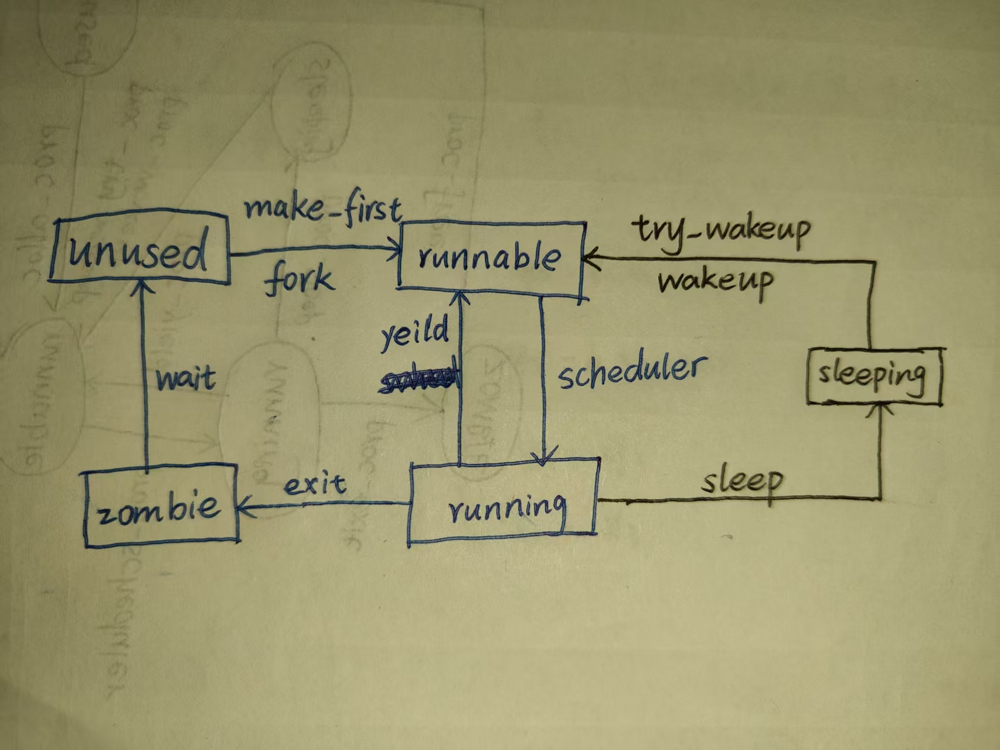

# LAB-6: 单进程走向多进程——进程调度与生命周期

**前言**

经过lab-4的初创和lab-5的完善, proczero已经比较成熟了

从零到一很缓慢, 但是从一到多很快：可以"复制proczero"来产生更多进程

产生更多进程后, 需要解决新产生的两个问题

- 多个进程会竞争CPU资源 (之前几乎由proczero独占)

- 进程新生与死亡的问题 (之前的proczero诞生后永不死亡)

因此, 本次实验主要关注两个主题: 进程调度 + 生命周期

## 代码组织结构

```
ECNU-OSLAB-2026-RS
├── pictures       README使用的图片目录 (CHANGE, 日常更新)
├── README.md      实验指导书 (CHANGE, 日常更新)
├── crates
│   ├── kernel/src
│   │   ├── lock
│   │   │   ├── spinlock.rs (CHANGE, 锁守卫交接接口)
│   │   │   └── sleeplock.rs (TODO, 实现睡眠锁)
│   │   ├── mem/kvm.rs (TODO, 映射多个内核栈)
│   │   ├── trap
│   │   │   ├── timer.rs (TODO, 时钟等待与唤醒)
│   │   │   ├── mod.rs (TODO, 内核态时钟抢占)
│   │   │   └── user.rs (TODO, 用户态时钟抢占)
│   │   ├── proc
│   │   │   ├── mod.rs (TODO, 创建首进程)
│   │   │   ├── lifecycle.rs (TODO, 进程数组与生命周期)
│   │   │   └── schedule.rs (TODO, 调度与睡眠唤醒)
│   │   ├── syscall
│   │   │   ├── mod.rs (CHANGE, 系统调用分派)
│   │   │   ├── sysfunc.rs (TODO, 打印系统调用)
│   │   │   └── process.rs (TODO, 进程系统调用)
│   │   └── main.rs (TODO, 初始化进程数组并进入调度器)
│   └── uapi/src/lib.rs (CHANGE, 系统调用号)
└── user/src
    ├── bin/init.rs (按测试需求修改)
    └── syscall.rs (CHANGE, 用户系统调用接口)
```

**标记说明**

**NEW**: 新增源文件, 直接拷贝即可, 无需修改

**CHANGE**: 旧的源文件发生了更新, 直接拷贝即可, 无需修改

**TODO**: 你需要实现新功能 / 你需要完善旧功能

## 准备工作: 引入进程数组

首先关注Proc结构体的变化 (in `crates/kernel/src/proc/mod.rs`), 我们新增了若干字段:

- `name: [u8; 16]` 进程名称, 服务于debug

- `lock: SpinLock` 自旋锁, 用于保证共享字段的访问和修改不被打断

- `state: State` 共享字段1: 进程状态 (共5种), 与生命周期相关

- `parent: AtomicPtr<Proc>` 共享字段2: 当前进程的父进程, 进程复制过程包含父子关系的建立

- `exit_code: i32` 共享字段3: 进程的退出状态 (类似函数用返回值来代表执行情况)

- `chan: usize` 共享字段4: 进程睡眠的位置 / 进程等待的资源 (与sleeping状态相关)

共享字段的含义: 进程B可能会访问/修改进程A的共享字段, 进程A的非共享字段只有自己关心

因此, 为了保证状态访问/修改的原子性, 访问进程共享字段时通常需要先持有自旋锁

我们在`crates/kernel/src/proc/lifecycle.rs`中定义了一个进程数组`TABLE`, 最多支持**N_PROC**个进程同时存在

很自然的, 定义进程数组后, **PROCZERO**将从元素变成指向元素的指针

另外, 进程数组中的每一个进程都应该拥有一个全局的标识符PID, 我们维护一个全局的**NEXT_PID**来支持这一点

`TABLE`和之前遇到的`NODE_LIST: [Node; N_MMAP]`都是资源仓库

请你先完成下面三个函数, 实现仓库的有序管理

- `lifecycle::init` 对系统资源(static变量)进行初始化赋值 (调用`lifecycle::pid_init`将**NEXT_PID**设置为1)

- `lifecycle::slot_alloc` 从资源仓库申请一个空闲的进程结构体, 完成通用初始化逻辑, 连同锁守卫返回 (注意: (*p).context.ra应该设置为`schedule::first_return`)

- `lifecycle::free` 向资源仓库释放一个进程结构体(及其包含的资源)

之后, 你需要改写之前的 `proc::make_first`, 主要是以下两点:

- 可以通过`lifecycle::slot_alloc`申请**PROCZERO**, 删去一些不必要的复制

- 只需要完成**PROCZERO**的初始化并解锁即可, 不应直接调用`arch_switch`逻辑

最后, 在 `crates/kernel/src/mem/kvm.rs`的`kvm::init`中, 需要将内核栈映射从单个拓展到多个。`proc::kstack`接收的是进程在数组中的下标, 每个栈之间留一页不映射。内核栈随数组槽位重复使用, `lifecycle::free`不释放它。

## 基于循环扫描的进程调度

`kernel_main`函数做完所有初始化后, 会执行`schedule::scheduler`启动调度器, 随后永不返回

因此, 我们可以这样描述各个CPU最初执行流做的事情 (下面称它们为原生进程, QEMU有两个, VisionFive2有四个):

- OpenSBI将控制权交给内核后, 各个原生进程经过`entry.S -> boot.rs -> main.rs`进入kernel_main函数

- 主核的原生进程完成系统资源初始化(包括PROCZERO的准备), 每个原生进程完成所在核心的初始化

- 所有原生进程在初始化完成后进入调度器死循环, 从初始化者变成调度选择与缓冲者

**结合schedule::sched和schedule::scheduler来说明进程调度的过程:**

- 原生进程执行调度器逻辑(`schedule::scheduler`), 循环扫描进程数组, 找到一个处于RUNNABLE状态的用户进程A

- 通过`arch_switch(原生进程上下文, 用户进程A上下文)`完成第一次执行流切换(`arch_switch`): 原生进程->用户进程A

- 用户进程A使用`schedule::sched`主动/被动释放CPU, 完成第二次执行流切换(`arch_switch`): 用户进程A->原生进程

- 原生进程继续扫描进程数组, 找到新的处于RUNNABLE状态的用户进程B......

**注意: 当原生进程执行时, 用`proc::set_current(core::ptr::null_mut())`清空本核的当前进程; 用户进程A执行时, 用`proc::set_current`将它设为本核的当前进程**

进程调度的算法非常简单, 但是切换逻辑非常严密和精巧, 值得你细细琢磨 

仔细考虑调度器在进程调度中的选择与缓冲作用 (用户进程A切换到用户进程B需要两次上下文切换)

理解上述逻辑后请完成 `schedule::sched` 和 `schedule::scheduler` 函数

切换时, 调度器和进程要把进程锁交给对方释放, 以免两个CPU同时使用同一个进程的内核栈。进入`schedule::sched`时应当只持有当前进程的锁, 关闭中断, 并已将状态改为非RUNNING。首次运行的进程还需要在`schedule::first_return`中释放调度器交来的锁, 再调用`trap::user::enter_user`。

Rust通过`SpinGuard::handoff`交出锁守卫, 由接收执行流用`SpinLock::resume`取得新的守卫。切换前要结束对进程字段的可变借用, 不要让旧守卫跨越切换。持有锁字段的引用时, 只通过原始指针访问其他字段, 不要再创建覆盖整个Proc的可变引用。

进程再次运行时可能已经换了CPU, 因此不要继续使用切换前的CPU编号。`schedule::sched`要保存并恢复调用者在解锁后是否开启中断的设置, 可使用`cpu::resume_interrupts`和`cpu::set_resume_interrupts`, 不要把原CPU的中断嵌套计数复制过来。

## 基于时钟的抢占式调度

完成上面的事情后, 我们发现缺少一种强制性手段来打断长进程的执行, 可能导致排在后面的短进程长时间得不到响应

出于实现简单的考虑, 我们可以在用户态和内核态的时钟中断处理完成后, 强迫当前进程主动交出CPU使用权

请你完成`schedule::yield_cpu`函数, 并在`trap::kernel_trap`和`trap::user::user_trap`的时钟处理后调用它 (先确认当前存在RUNNING进程), 将进程的状态从**RUNNING**改为**RUNNABLE**并调用`schedule::sched`

做完这些事情, 每个**RUNNABLE**进程相当于持有1个长度为1的时间片, 用完后就要交出CPU使用权, 等待下一次被调度

## 进程状态转换

我们定义了五种进程状态, 从冷到热依次是:

- **unused** 进程已经死亡 / 进程还没初始化, 不持有任何资源

- **zombie** 进程濒临死亡, 不会再有任何活动, 等待父进程回收

- **sleeping** 进程睡眠, 通常是因为尝试获取某种资源但是失败了, 等待被唤醒

- **runnable** 进程准备就绪, 随时可以运行

- **running** 进程正在CPU上执行

下面的图片显示了进程状态的转换过程, 大致可以分成3个部分:

- 如果是短进程 (很快就能完成任务), 它会经历 `unused -> runnable -> running -> zombie -> unused`

- 如果是长进程, 它会在前者的基础上多一些 `runnable -> running -> runnable -> running...` 的调度过程

- 如果更复杂一些, 它会在前者的基础上多一些睡眠和唤醒的过程 `running -> sleeping -> runnable ->...`



## 进程生命周期-1: fork exit wait

首先讨论图中蓝色部分的状态转换

**1. 关于lifecycle::fork--子进程复制**

用户进程的产生只有以下两条路径:

- PROCZERO: 一切都是精心准备和填充的, 有一个自己的`proc::make_first`函数来规定所有细节

- 其他进程: 通过`lifecycle::fork`函数复制和继承父进程的状态

从另一个视角来看, 所有活跃的用户进程构成了一个树形结构, 其中`PROCZERO`是根节点, 比较特别

`lifecycle::fork`的主要工作包括以下几部分:

- 通过`lifecycle::slot_alloc`申请一个空闲的进程结构体

- 复制父进程的用户内存、frame和mmap区域链, 子进程使用自己的锁、PID和内核栈

- 记录父子关系

- 设置子进程的返回值为0 (便于用户程序区分父进程和子进程)

子进程复制的是父进程执行ecall时的frame, 用HAL的`syscall::return_value`设置返回值并推进一次PC。父进程的返回值则交给`trap::user::user_trap`处理, 不要让子进程再次执行同一条ecall。没有空闲进程槽时, `lifecycle::fork`返回-1。

你可能敏锐地发现了: 假设子进程和父进程毫无关系(两个不同的ELF文件), 完全复制父进程的状态并不合理

我们将在lab-9引入`proc::exec::exec`来解决这个问题, 典型的进程创建路径其实是: `fork` 搭建骨架, `exec` 填充血肉

另一个值得考虑的问题是: 既然`proc::exec::exec`会重新充填血肉, 那很多内存拷贝其实是不必要的

是的, 典型的做法是利用**Page Fault**机制做**写时复制**, 让父子进程暂时共享只读页面, 等到写入时再复制物理页

这与用户栈的按需分配不同: 栈增长时需要新页面, 写时复制则需要保留原页面的数据

你可以参考xv6的相关实验 (copy-on-write) 来优化`lifecycle::fork`的效率, 这里不做要求

**2. 关于lifecycle::exit--进程退出**

进程退出的直观想法是: 调用`lifecycle::free`从**RUNNING**状态直接进入**UNUSED**状态

然而, 就像人无法亲自给自己办葬礼一样, 进程也无法主动杀死自己并回收资源

**回收资源的逻辑不可能由一个已经不存在的进程来执行!**

因此, 参考父进程创建子进程, 我们想到也可以让父进程回收子进程

子进程只需要标记自己进入了**ZOMBIE**状态, 父进程知晓后就会来回收它了

由于进程的树形结构, 还需要考虑一个问题:

如果父进程A先于子进程A1 A2退出了, 谁来负责子进程A1 A2的退出善后呢?

我们注意到`PROCZERO`是一个永不退出的进程, 因此可以通过`lifecycle::reparent`将这样的A1 A2"过继给"`PROCZERO`

最后, 子进程进入**ZOMBIE**状态前, 应该设置一个退出状态`exit_code`, 让父进程知道子进程的情况

父进程和子进程可能同时在不同CPU上运行, 操作父子关系时要先锁祖先, 再锁后代。托孤应在当前进程进入ZOMBIE前完成, 按根进程、原父进程、孩子的顺序加锁, 遇到同一进程不重复加锁。不要拿着孩子的锁再去等待父亲或根进程的锁。

**3. 关于lifecycle::wait--父进程等待回收子进程**

父进程会循环扫描进程数组, 直到发现自己某个孩子进入**ZOMBIE**状态

随后调用`lifecycle::free`完成子进程的回收释放工作

扫描时先持有父进程的锁, 用原子操作读取`parent`筛选孩子, 再锁住匹配的孩子并重新检查关系, 不要逐个锁住无关进程。没有孩子时返回-1, `sys::wait(core::ptr::null_mut())`表示不接收退出状态, 非空指针则先复制退出状态再回收孩子。

**4. 一种典型的组合使用方法**

```rust
use oslab_user::syscall as sys;

// fork复制本例的独立地址空间, wait接收局部变量的地址。
unsafe {
    let pid = sys::fork(); // 分支
    if pid == 0 { // 子进程
        do_something_1();
        sys::exit(0); // 退出
    } else { // 父进程
        let mut state = 0i32;
        sys::wait(&raw mut state); // 等待
        do_something_2();
    }
}
```

## 进程生命周期-2: sleep wakeup + 睡眠锁

接下来讨论图中黑色部分加入的影响

首先考虑`lifecycle::wait`不完善的地方:

父进程等待子进程退出的时候, 会遍历进程数组, 找不到目标就调用`schedule::yield_cpu`让出CPU控制权

然而, 让出CPU后父进程还是**RUNNABLE**状态, 随时可能被调度, 这反而耽误子进程的执行

因此, 我们需要在**RUNNABLE**之下再建立一个层级(**SLEEPING**), 这个层级的进程不是无条件执行的, 而是依赖某种资源

- 当进程无法获得这种资源, 就会从**RUNNING**状态进入**SLEEPING**状态, 不可被调度执行

- 当进程可以获得这种资源, 就会从**SLEEPING**状态进入**RUNNABLE**状态, 可以被调度执行

就像当时引入**串口中断**来解决轮询效率低下的问题, 这里引入睡眠态来解决**RUNNABLE**的无效调度问题

- 当父进程调用`lifecycle::wait`时, 遍历一轮后就会执行`schedule::sleep`, 将资源设置为自己

- 当子进程调用`lifecycle::exit`时, 会执行`lifecycle::try_wakeup`, 将资源设置为父进程

理解了这部分后, 请实现下面三个函数:

- `schedule::sleep` 当前进程睡眠, 等待某种资源

- `schedule::wakeup` 唤醒等待某种资源的全部进程

- `lifecycle::try_wakeup` 仅针对唤醒父进程的情况, 调用前已持有被唤醒进程的锁, 函数内不重复加锁

一个值得思考的问题: `schedule::sleep`传入资源的同时为何要传入一个锁守卫, 它起到什么作用? 函数返回时会交还重新取得的条件锁守卫。

另一个值得观察的地方: 之前提到进程结构体里有一些字段会被共享访问, 请你找一找哪些地方涉及这样的共享, 以及特例是什么?

完成这部分后, **crates/kernel/src/proc/**的工作基本结束了, 请你将目光放到新增加的**crates/kernel/src/lock/sleeplock.rs**

我们在自旋锁和进程睡眠唤醒机制的基础上, 建立了睡眠锁这种新的锁类别

- 自旋锁的一致性保证依赖开关中断和原子指令, 获取资源失败时会不断尝试(忙等), 适合保护只被短期持有的资源

- 睡眠锁的一致性保证依赖自旋锁, 获取资源失败后会让当前进程进入睡眠状态, 适合保护会被长期持有的资源

请你完成睡眠锁的相关函数, 它的整体框架与自旋锁是完全一致的, 我们在后面的实验中会用到 (文件系统)。获取锁返回`SleepGuard`, 释放逻辑在`SleepGuard::drop`中。

## 相关系统调用

我们在lab-5中已经建立了完善的系统调用流程, 所以功能完成后需要封装成系统调用, 便于在用户空间测试

本次实验新增了以下系统调用, 用户接口在`user/src/syscall.rs`中

```text
pub unsafe fn print_str(str: *const u8) -> isize; // 打印字符串
pub fn print_int(num: i32) -> isize;              // 打印32位整数
pub fn getpid() -> isize;                         // 获取当前进程的pid
pub unsafe fn fork() -> isize;                    // 进程复制
pub unsafe fn wait(status: *mut i32) -> isize;     // 等待子进程退出
pub fn exit(exit_code: i32) -> !;                 // 进程退出
pub fn sleep(ntick: usize) -> isize;              // 进程睡眠ntick个时钟周期
```

其中前面的6个都比较简单, 这里不做详细说明, 重点介绍一下最后1个

这个系统调用的作用是让当前进程睡眠ntick个时钟周期 (默认设置下一个时钟周期大约0.1s)

它的工作逻辑是:

- 让当前进程以共享的时钟计数为资源, 进入睡眠状态

- 每当发生时钟中断, 系统时钟进行了更新, 就唤醒它执行检查逻辑

- 如果发现已经到达了目标时间, 就离开循环; 否则重新进入睡眠状态

实现它的方法:

- 在`timer::update`中增加`schedule::wakeup`逻辑

- 完成`timer::wait`函数, 增加`schedule::sleep`逻辑, 供`syscall::process::sleep`调用

## 测试用例

以下测试只需要修改**user/src/bin/init.rs**

**测试1** (测试现象示意)


```rust
#![no_std]
#![no_main]
use oslab_user::syscall as sys;
#[unsafe(no_mangle)]
#[unsafe(link_section = ".text.entry")]
pub extern "C" fn _start() -> ! {
    if sys::getpid() == 1 {
        // SAFETY: 静态 NUL 字符串在调用期间有效。
        unsafe {
            sys::print_str(c"\nproczero: hello ".as_ptr().cast());
            sys::print_str(c"world!\n".as_ptr().cast());
        }
    }
    loop { core::hint::spin_loop(); }
}
#[panic_handler]
fn panic(_: &core::panic::PanicInfo<'_>) -> ! { loop { core::hint::spin_loop(); } }
```

**测试2** (测试现象示意)


请在内核代码合适的位置增加提示性输出

```rust
#![no_std]
#![no_main]
use oslab_user::syscall as sys;
#[unsafe(no_mangle)]
#[unsafe(link_section = ".text.entry")]
pub extern "C" fn _start() -> ! {
    // SAFETY: 本例无跨进程共享的 Rust 所有权，字符串均为静态 NUL 字符串。
    unsafe {
        sys::print_str(c"level-1!\n".as_ptr().cast());
        sys::fork();
        sys::print_str(c"level-2!\n".as_ptr().cast());
        sys::fork();
        sys::print_str(c"level-3!\n".as_ptr().cast());
    }
    loop { core::hint::spin_loop(); }
}
#[panic_handler]
fn panic(_: &core::panic::PanicInfo<'_>) -> ! { loop { core::hint::spin_loop(); } }
```

**测试3** (测试现象示意)


`str3`使用局部数组, 让这组测试实际读取复制后的用户栈。

```rust
#![no_std]
#![no_main]
use oslab_user::syscall as sys;
#[unsafe(no_mangle)]
#[unsafe(link_section = ".text.entry")]
pub extern "C" fn _start() -> ! {
    const PAGE: usize = 4096;
    const MMAP_BEGIN: usize = (1usize << 38) - (2 + 4096 + 16384) * PAGE;
    // 真正的局部栈数组；volatile 写保证在 fork 前实际访问栈页。
    let mut str3 = [0u8; 15];
    for (i, byte) in b"STACK_REGION\n\n\0".iter().enumerate() {
        // SAFETY: i 在局部数组范围内。
        unsafe { str3.as_mut_ptr().add(i).write_volatile(*byte); }
    }
    // SAFETY: 映射成功后才访问；复制范围不超过一页；wait 使用独占局部 i32。
    // fork 只复制本例单线程地址空间，无共享 Rust 所有权；不保留跨调用的可变引用。
    unsafe {
        let mapped = sys::mmap(MMAP_BEGIN, PAGE);
        if mapped == -1 { loop { core::hint::spin_loop(); } }
        let str1 = mapped as *mut u8;
        core::ptr::copy_nonoverlapping(c"MMAP_REGION\n".as_ptr().cast::<u8>(), str1, 13);
        let top = sys::brk(0) as usize;
        if sys::brk(top + PAGE) == -1 { loop { core::hint::spin_loop(); } }
        let str2 = top as *mut u8;
        core::ptr::copy_nonoverlapping(c"HEAP_REGION\n".as_ptr().cast::<u8>(), str2, 13);
        sys::print_str(c"\n--------test begin--------\n".as_ptr().cast());
        let pid = sys::fork();
        if pid == 0 {
            sys::print_str(c"child proc: hello!\n".as_ptr().cast());
            sys::print_str(str1);
            sys::print_str(str2);
            sys::print_str(str3.as_ptr());
            sys::exit(1234);
        } else {
            let mut exit_state = 0i32;
            sys::wait(&raw mut exit_state);
            sys::print_str(c"parent proc: hello!\n".as_ptr().cast());
            sys::print_int(pid as i32);
            if exit_state == 1234 { sys::print_str(c"good boy!\n".as_ptr().cast()); }
            else { sys::print_str(c"bad boy!\n".as_ptr().cast()); }
        }
        sys::print_str(c"--------test end----------\n".as_ptr().cast());
    }
    loop { core::hint::spin_loop(); }
}
#[panic_handler]
fn panic(_: &core::panic::PanicInfo<'_>) -> ! { loop { core::hint::spin_loop(); } }
```

**测试4** (测试现象示意)


请在内核代码合适的位置增加提示性输出

```rust
#![no_std]
#![no_main]
use oslab_user::syscall as sys;
#[unsafe(no_mangle)]
#[unsafe(link_section = ".text.entry")]
pub extern "C" fn _start() -> ! {
    // SAFETY: 单线程独立地址空间；静态 NUL 字符串有效，wait(null) 忽略状态。
    unsafe {
        let pid = sys::fork();
        if pid == 0 {
            sys::print_str(c"Ready to sleep!\n".as_ptr().cast());
            sys::sleep(30);
            sys::print_str(c"Ready to exit!\n".as_ptr().cast());
            sys::exit(0);
        } else {
            sys::wait(core::ptr::null_mut());
            sys::print_str(c"Child exit!\n".as_ptr().cast());
        }
    }
    loop { core::hint::spin_loop(); }
}
#[panic_handler]
fn panic(_: &core::panic::PanicInfo<'_>) -> ! { loop { core::hint::spin_loop(); } }
```

**温馨提示:** 

- 测试前, 请先理解以上测试用例在测试什么, 并对测试结果有一个预期 

- 尽量多补充一些其他测试用例以验证代码的正确性

**尾声**

第二阶段, 我们围绕进程管理的主题, 基于一阶段构建的基础设施

从一到多, 从易到难地构建了进程管理模块, 同时完善和加强了**lock | mem | syscall | trap**模块

截至lab-6, **进程管理**和**内存管理**的主要内容已经相对完善了

但是还有一个大问题没有解决: 只有CPU和内存的操作系统, 掉电后就什么都不剩了......

我们将在第三阶段(lab-7到lab-9)引入磁盘这种关键外设, 它可以在断电的情况下保存数据

最重要的, 我们将**基于磁盘自底向上地构建文件系统**, 并赋能内存管理和进程管理模块

**欢迎来到文件系统的世界!**

## 进阶目标

### 超时 wait

本次实验中, 父进程会一直等待孩子退出。如果孩子迟迟不能完成任务, 父进程也就无法继续做其他事情。超时等待允许父进程在等待一段时间后返回, 再决定是否继续等待。

请你为wait增加超时参数, 可以从睡眠条件和时钟唤醒入手。分别让孩子在截止时间之前、之后和附近退出, 观察返回值与资源回收情况, 想一想超时和孩子退出同时发生时该如何处理, 避免遗漏唤醒或重复回收。

### 可切换的调度策略

循环扫描让每个就绪进程轮流得到CPU, 但不同任务的需要未必相同。一直进行计算的任务与经常等待资源的任务放在一起时, 调度顺序会影响它们的响应速度。

请你尝试另一种调度策略, 可以先把选取进程的规则与上下文切换分开, 切换时仍按本章的方式交接进程锁。构造计算密集和频繁睡眠的两组任务, 记录等待时间和获得CPU的次数, 比较不同策略的公平性与响应速度。

### tickless

即使没有可运行进程, 周期时钟仍会不断打断CPU。tickless的做法是根据下一件需要处理的事情设置定时器, 例如最近一个睡眠进程的唤醒时间, 从而减少空闲时的中断。

请你尝试用睡眠队列记录截止时间, 并据此设置下一次时钟中断。比较空闲时的中断次数, 观察多个进程能否按时唤醒, 同时考虑其他核加入一个更早到期的等待时, 应如何通知负责计时的核心。
